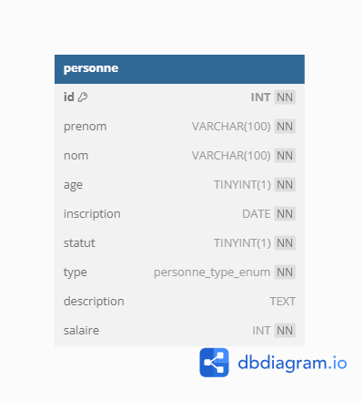
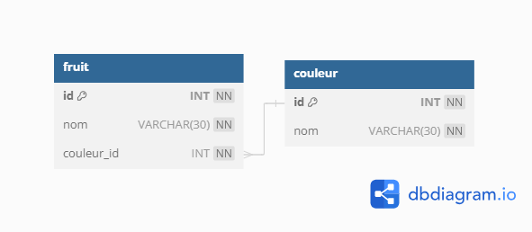

# Les fondamentaux SQl

# Plan de la formation

## JOUR 1

### Creation de data base
- Créer une base de données  
- Effacer une base de données  
### Creation d'une table
- Créer une table  
- Effacer une table  
- Ajouter des champs avec un type  
- Créer une contrainte de clef primare  
- Créer une contrainte de nullité  
- Mettre des valeurs par défault  

### Ajouter des données
- Ajouter des données avec ou sans clef primaire  
- Tester les valeurs par défaults  
- Tester les valeurs null  

### Lecture des données
- Prendre en main **as**
- Utiliser la condition **where**
- Filtrer avec **LIMIT**
- Classer avec **ORDER BY**

**TP 01 invitation**
Création d'une table personne
  

  
## JOUR 2

### Révision
TP 02  de Révision chat du JOUR 1

### la clef étrangère
- Créer une clef étrangère  
- Remplir une table avec une clef étrangère  
- Présentation de db diagram    

### Les Jointures :
LEFT RIGHT ou INNER JOIN ?
Mettre en place des jointures pour extraires les données

### TP 03 Chats avec clef étrangère
- Afficher les chat avec les couleurs des yeux 

### TP 04 Films  avec clef étrangère
- Afficher les films avec les catégories

### TP 05 CRM 
- Extraire les données avec plusieurs jointures
- mettre en place un left join 